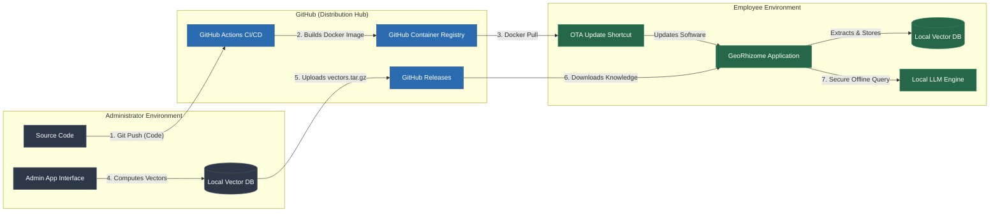
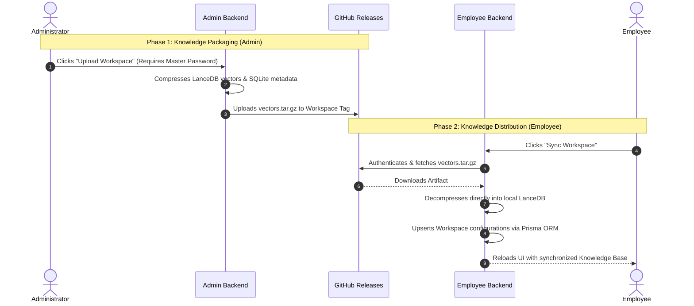

# GeoRhizome AI Enterprise Knowledge Platform

> **Repository Structure:**
> - `/installers` — Contains the automated deployment payloads (`install.sh`, `install.ps1`).
> - `/georhizome-ai-source` — Contains the core application codebase (React, Express, Prisma).
> - `.github/workflows` — Contains the CI/CD pipelines for GHCR deployment.

---

## 1. Executive Summary
GeoRhizome AI is a fully autonomous, localized enterprise Artificial Intelligence platform. It is engineered to allow organizations to distribute massive, highly-sensitive corporate knowledge bases to employee laptops without requiring centralized cloud inference or third-party API exposure. 

By leveraging a decentralized architecture, GeoRhizome AI shifts the heavy computational burden of vector embedding to the Administrator. The resulting knowledge databases and software updates are seamlessly distributed to non-technical employees via an automated, zero-friction delivery network powered by GitHub.

---

## 2. System Architecture

The ecosystem is strictly divided into three physical environments: the **Administrator Environment**, the **GitHub Distribution Hub**, and the **Employee Environment**. 

The diagram below illustrates the two primary distribution pipelines: 
1. **The Code Pipeline:** How software updates reach the employee.
2. **The Knowledge Pipeline:** How vectorized corporate data reaches the employee.

---

## 3. Core Architectural Pillars

GeoRhizome AI is built upon five foundational pillars designed for enterprise scale and security.

### Pillar 1: 100% Local Inference & Privacy
To guarantee the absolute privacy of corporate trade secrets and internal documents, the application is strictly configured to communicate with local Large Language Models (e.g., via Ollama or LM Studio). No document data, prompt history, or vector embeddings ever leave the employee's local hardware during the querying phase.

### Pillar 2: Intelligent Hardware Profiling
Employee hardware varies drastically. To prevent system crashes, the installation engine dynamically profiles the employee's physical memory (RAM). Based on available hardware, the system automatically curates and recommends the optimal neural network quantization (e.g., advising an 8GB machine to utilize a highly compressed Q2_K model, while allocating unquantized models to 32GB workstations).

### Pillar 3: Zero-Touch Installation Engine
The installation process requires zero terminal interaction from the employee. 
- Custom `install.ps1` (Windows) and `install.sh` (Mac/Linux) payloads automatically verify Docker daemon health, establish local environments, and securely authenticate with the private GitHub Container Registry using deeply obfuscated read-only credentials.
- The installer automatically drops native Desktop shortcuts that control the application lifecycle and software updates.

### Pillar 4: Asynchronous Vector Synchronization
Vectorizing thousands of pages of PDF documentation is highly computationally expensive. Forcing standard employee laptops to compute these embeddings would result in severe hardware throttling.
- **The Solution:** The Administrator processes all documents on a high-end workstation. The GeoRhizome backend packages the resulting LanceDB storage folder and SQLite metadata into a `vectors.tar.gz` artifact.
- **The Delivery:** This artifact is pushed directly to a workspace-specific GitHub Release. Employees simply click a "Sync" button in their UI, which securely downloads the pre-computed artifact, extracts it directly into their local LanceDB instance, and utilizes Prisma ORM to seamlessly upsert the workspace metadata.

### Pillar 5: Over-The-Air (OTA) Updates & Maintenance
Maintaining version parity across an enterprise fleet is handled autonomously via the OTA engine.
- **CI/CD Pipeline:** Any code pushed to the `main` branch triggers a GitHub Action that compiles the Node.js backend and React frontend into a unified Docker Image, pushing it to `ghcr.io` tagged as `latest`.
- **Employee Updates:** Employees execute the native "Update GeoRhizome AI" desktop shortcut generated during installation. This runs a silent `docker compose pull`, replacing the local container with the newest cloud version.
- **Data Wiping API:** A dedicated `DELETE /system/workspace-vectors/:slug` endpoint allows employees to securely purge local vector data to free up hard drive space, executed via a native UI confirmation modal.

---

## 4. Developer & Deployment Guide

### Modifying the Codebase
1. Ensure Docker Desktop is running locally.
2. Navigate to the `georhizome-ai-source` directory.
3. Execute `yarn dev:all` to concurrently boot the Vite frontend (Port 3000), Express backend (Port 3001), and the Document Collector (Port 8888).

### Pushing Enterprise Updates
1. Commit your modifications.
2. Execute the provided `./sync_to_lts.sh` script to mirror the source directory to the CI/CD deployment repository.
3. Push to the `main` branch of the LTS repository. GitHub Actions will automatically handle the Docker build and GHCR deployment.

---

## 5. Security & Licensing

**PROPRIETARY AND CONFIDENTIAL**

This software, including all source code, compiled binaries, and associated documentation, is the proprietary and confidential property of 株式会社GeoRhizome.

1. **NO OPEN SOURCE RIGHTS:** This software is NOT open source. Any prior open-source licensing associated with underlying architectures has been superseded by this proprietary license for all internal deployments.
2. **RESTRICTIONS ON USE:** No part of this software may be copied, reproduced, distributed, transmitted, broadcast, displayed, sold, licensed, reverse-engineered, or otherwise exploited for any purpose whatsoever outside of authorized internal enterprise deployment without prior written consent.
3. **UNAUTHORIZED DISTRIBUTION:** Unauthorized copying or distribution of this software or its components via any medium is strictly prohibited.
