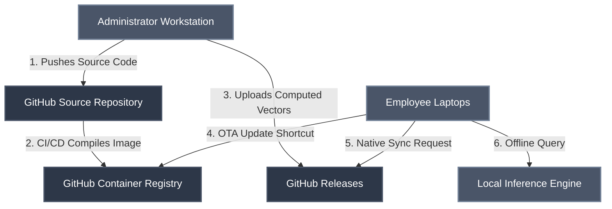
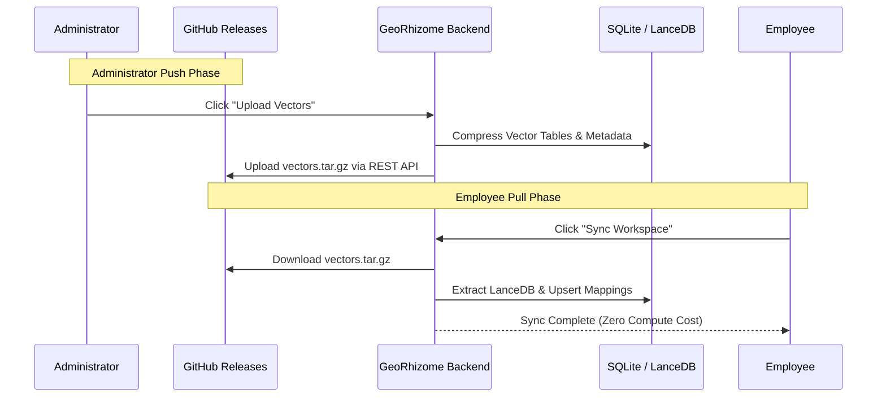

# GeoRhizome AI Enterprise Architecture

## Overview
GeoRhizome AI is an enterprise-grade, localized AI Knowledge Management System built to securely distribute corporate intelligence without relying on centralized cloud inference. By utilizing a decentralized, containerized architecture, the system allows administrators to curate and deploy complex vector databases seamlessly to standard employee hardware with zero friction.

This repository serves as the core source code and distribution hub for the GeoRhizome AI ecosystem.

---

## High-Level System Architecture

The system operates on a hub-and-spoke distribution model. GitHub acts as the secure, serverless intermediary for both software container updates and heavy vector database synchronization.

---

## Core Capabilities

### 1. Zero-Friction Automated Deployment
End-users are not required to possess terminal experience or DevOps knowledge. The platform provides automated `install.ps1` (Windows) and `install.sh` (macOS/Linux) payloads that:
- Conduct hardware profiling to determine the optimal deployment configuration.
- Silently authenticate with the private Container Registry using embedded, obfuscated credentials.
- Pull the pre-compiled Docker images and generate native Desktop shortcuts for application launch.

### 2. Pre-Computed Knowledge Synchronization
Vectorizing thousands of pages of corporate documentation requires significant compute power. GeoRhizome AI shifts this burden entirely to the Administrator.
- **Admin Upload:** The Administrator ingests heavy PDFs on a high-performance workstation. The system's Node.js backend compresses the resulting LanceDB vector tables and SQLite metadata into a `vectors.tar.gz` artifact and pushes it to a specific GitHub Release tag (e.g., `workspace-company-guidelines`).
- **Employee Sync:** The employee simply clicks "Sync" in their local UI. The backend fetches the artifact, bypasses the embedding process, and uses Prisma to `upsert` the workspace metadata directly into their local environment.

### 3. Over-The-Air (OTA) Updates
The deployment utilizes a strictly `latest`-tagged CI/CD pipeline to eliminate version fragmentation among employees.
- When source code is pushed to the `main` branch, a GitHub Action automatically compiles the new Vite frontend and Express backend into a unified Docker image.
- Employees execute a generated "Update" desktop shortcut, which triggers a `docker compose pull` to silently replace their local containers with the newest iteration.

### 4. Granular Data Governance
Employees maintain full control over their local storage allocations. A native API endpoint (`DELETE /system/workspace-vectors/:slug`) allows users to instantly purge vector data from their hard drives. The backend surgically drops `workspace_documents` mappings in Prisma and securely deletes the physical LanceDB directory without interrupting the main container runtime.

---

## Technical Stack

- **Frontend:** React, Vite, TailwindCSS
- **Backend:** Node.js, Express
- **Database Engine:** Prisma ORM, SQLite (Relational), LanceDB (Vector)
- **Containerization:** Docker, Docker Compose
- **CI/CD Pipeline:** GitHub Actions, GitHub Container Registry (GHCR)

---

## Licensing & Confidentiality

**PROPRIETARY AND CONFIDENTIAL**

This software and its associated documentation are the proprietary and confidential property of BAIZ1D (GeoRhizome AI). Unauthorized copying, distribution, or reverse-engineering of this repository, via any medium, is strictly prohibited. All rights reserved.
